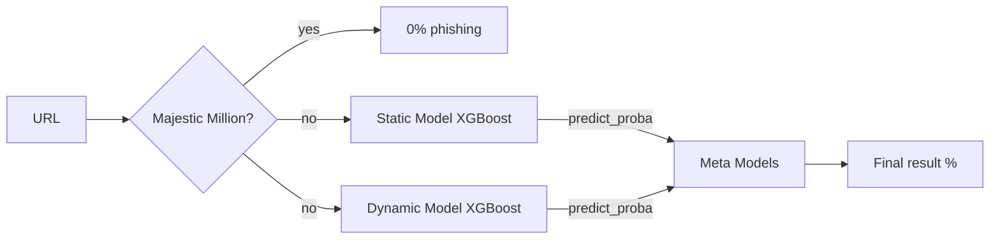

# Phishing Analyzer

Developed a real-time working phishing analyzer based on Four Models (stacking ensemble) - Static Model (XGBoost) Dynamic Model (XGBoost) and 2 Meta Models (XGBoost and LR) based on the predict_proba of the previous two.

## How does it work

After giving the URL to the program, analysis and extraction of features is performed.

###  1. Static analysis

The first stage is static analysis which examines only the URL string. It gives the model information about the domain length, Shannon entropy, Levenshtein distance to top 500 domains, how many subdomains, how many digits, is the tld considered suspicious etc.

###  2. Dynamic analysis
The second stage is dynamic analysis, the program examines the website using libraries like requests, selenium (stealth), and WHOIS. This stage gives us information about SSL, number of redirections, text to html ratio, did the domain change after redirection, number of: forms (password and text), scripts, links, external links, hidden elements, images, iframes. It also checks the Levenshtein distance between the page title and domain, counts suspicious, phishing words, checks if whois connection is successful or not, counts the domain age in days.

###  3. Meta Models
After collecting all the features, we pass them to both models, Static and Dynamic (XGBoost), both models give a prediction whether the website is phishing or not, then our meta model takes these two probabilities and based on them determines the final result.

###  4. Whitelist
If the website is on the whitelist (majestic million) then it is considered 100% safe and we do not extract the features from the site.



## Results

I did a test based on 13k URLS (50% phish and 50% safe)

|      Model          |AUC                          |False Positives/False negatives                         |
|----------------|-------------------------------|-----------------------------|
|Meta model XGBoost|        **0.9977**   |   76 / 142         |
|Meta model LR         |       **0.9976**   |173 / 93            |

- Both meta models achieve 98% recall and precision.
- Meta models perform much better than two separate (static and dynamic) models. Logistic Regression ensures much fewer False Negatives (missed phishing) which is crucial in cybersecurity. However, because of the high amount of False Positives (safe websites marked as phishing), it might be annoying for the user.


## Feature importance (SHAP)
### Static

### Dynamic

### ROC Curve


## Run with Docker
The initial version required the user to be compatible with my settings, manually download files, etc. To prevent this, I decided to use Docker to streamline the process.
### To build the image, run:
```
docker build -t phishing-analyzer .
```
There is a possibility that the Docker (on Windows) due to Chrome usage will consume a lot of RAM. To prevent this you can make a .wslconfig file in your home directory with:
```
[wsl2]
memory=3GB
processors=2
```
## Usage

```
docker run -it phishing-analyzer
```

## Example outputs:
```
Enter URL: https://ipkobizness.pl-radiant.info/ipko.php
STATIC: This site is 99.02% phishing
DYNAMIC: This site is 86.09% phishing
META MODEL LR: This site is 99.13% phishing

Enter URL: https://www.sztukakrajobrazu.pl/
STATIC: This site is 1.34% phishing
META MODEL LR: This site is 2.31% phishing
META MODEL XGB: This site is 0.32% phishing

Enter URL: https://google.com/
URL is on whitelist: 0% PHISH
```

## Data Collection

Data was collected using a custom multithreaded pipeline (`extract_urls.py`).
The final dataset (~85,000 URLs) was split into:
-   **80,000** training base models
-   **2,000** training meta models
-   **~3,000**  final evaluation (never seen during training)

- Phish URLs were collected from sites like: PhishTank, OpenPhish, and Phishinfo
- Safe URLs were collected from top-1m, curlie, random small websites
- All splits are stratified on `is_phish` (~50% phish, 50% safe).
## Project limitations

- New fresh domains can cause false positives in the model, it is difficult to distinguish phishing from safe based on features alone in such a case.
- Dynamic analysis requires the site to be reachable.
- Majestic Million (whitelist) covers popularity, not safety.
- Dynamic analysis adds 5–10 seconds per URL due to Selenium and WHOIS load.
- Docker can consume a lot of RAM in Windows.

## Author: Jan Kusiowski
