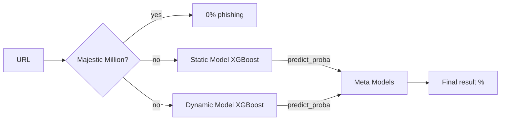
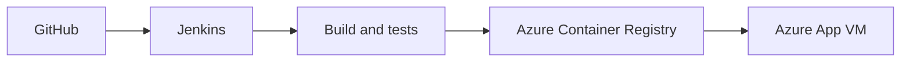

# Phishing Analyzer

Developed a real-time working phishing analyzer based on Four Models (stacking ensemble) - Static Model (XGBoost) Dynamic Model (XGBoost) and 2 Meta Models (XGBoost and LR) based on the predict_proba of the previous two. The analyzer runs as a FastAPI service inside a Docker container.

The project also includes automated tests, a Jenkins CI/CD pipeline, deployment through Azure Container Registry to an Azure VM, and infrastructure created with Terraform.

## How does it work

After giving the URL to the service, analysis and extraction of features is performed.

###  1. Whitelist
If the website is on the whitelist (majestic million) then it is considered 100% safe and we do not extract the features from the site.

###  2. Static analysis

The second stage is static analysis which examines only the URL string. It gives the model information about the domain length, Shannon entropy, Levenshtein distance to top 500 domains, how many subdomains, how many digits, is the tld considered suspicious etc.

###  3. Dynamic analysis
The third stage is dynamic analysis, the program examines the website using libraries like requests, selenium (stealth), and WHOIS. This stage gives us information about SSL, number of redirections, text to html ratio, did the domain change after redirection, number of: forms (password and text), scripts, links, external links, hidden elements, images, iframes. It also checks the Levenshtein distance between the page title and domain, counts suspicious, phishing words, checks if whois connection is successful or not, counts the domain age in days.

###  4. Meta Models
After collecting all the features, we pass them to both models, Static and Dynamic (XGBoost), both models give a prediction whether the website is phishing or not, then our meta model takes these two probabilities and based on them determines the final result.


```mermaid 
graph LR 
A[URL] --> W{Majestic Million?} 
W -->|yes| S[0% phishing] 
W -->|no| B[Static Model XGBoost] 
W -->|no| C[Dynamic Model XGBoost] 
B -->|predict_proba| D[Meta Models] 
C -->|predict_proba| D 
D --> E[Final result %] 
```


## Results

I did a test based on 8k URLS (50% phish and 50% safe)

|      Model          |AUC                          |False Positives/False negatives                         |
|----------------|-------------------------------|-----------------------------|
|Meta model XGBoost|        **0.9952**   |   144 / 74         |
|Meta model LR         |       **0.9943**   |148 / 79            |

- Both meta models achieve 98% recall and precision.
- Meta models perform much better than two separate (static and dynamic) models. At first, a Logistic Regression meta-model was tested as a baseline, XGBoost meta model gave much more False Negatives (phishing marked as safe) than LR. However, after optimizing scale_pos_weight parameter, XGBoost outperformed LR across all dimensions.


## Feature importance (SHAP)
### Static

### Dynamic


## Run with Docker
The first version was a CLI tool and required the user to be compatible with my settings, manually download files, etc. To prevent this, I decided to use Docker to streamline the process. The image now runs the API, not an interactive prompt.

```
git clone https://github.com/jjkusio/Phishing-analyzer.git
cd Phishing-analyzer
docker build -t phishing-analyzer .
docker run -p 8000:8000 phishing-analyzer
```

The service listens on port 8000. The image ships with a HEALTHCHECK on `/healthz`, so `docker ps` will report whether the container is healthy.

There is a possibility that the Docker (on Windows) due to Chrome usage will consume a lot of RAM. To prevent this you can make a .wslconfig file in your home directory with:
```
[wsl2]
memory=3GB
processors=2
```

## Run without Docker
```
git clone https://github.com/jjkusio/Phishing-analyzer.git
cd Phishing-analyzer
pip install -r requirements.txt
uvicorn api:app --host 0.0.0.0 --port 8000
```
Requirements: Python 3.10+, Google Chrome, ChromeDriver matching your Chrome version, Majestic Million CSV file (you have to download it by yourself) https://majestic.com/reports/majestic-million

## API

The service exposes two endpoints.

### POST /v1/analyze

Takes a URL, returns the phishing probability from every model in the ensemble.

```
curl -X POST http://localhost:8000/v1/analyze \
  -H "Content-Type: application/json" \
  -d '{"url": "https://solvro.pl"}'
```

```json
{
"Valid":true,
"Whitelist":false,
"Static":"11.82%",
"Dynamic":"28.06%",
"Meta_XGB":"33.20%",
"Meta_LR":"23.13%"
}      
```

A whitelisted domain skips feature extraction completely:

```
curl -X POST http://localhost:8000/v1/analyze \
  -H "Content-Type: application/json" \
  -d '{"url": "https://google.com/"}'
```

Error responses:

| Status | Meaning |
|--------|---------|
| 400 | Malformed URL, or a scheme other than http/https |
| 403 | Target is not allowed (literal IP, private, loopback or link local address) |
| 429 | Rate limit of 10 requests per minute was exceeded |
| 504 | The site did not respond in time |

Dynamic analysis takes 5 to 10 seconds per URL, so expect the request to hang for that long. The endpoint is limited to 10 requests per minute for each client IP.

### GET /healthz

Liveness check, used by the container HEALTHCHECK and the Jenkins pipeline.

```
curl http://localhost:8000/healthz
```

## Tests

The project currently contains 20 automated tests:

- API tests for `/healthz`, request validation, and unsupported protocols
- Unit tests for the static URL feature extraction
- A Selenium test which verifies that Chromium starts and can read a page

The tests can be run locally:

```
pytest -q
```

Jenkins runs the same test suite inside the newly built Docker image.

## CI/CD with Jenkins

The `Jenkinsfile` contains the build, test, and deployment pipeline. It:

1. Checks out the `main` branch.
2. Builds a Docker image tagged with the Jenkins build number.
3. Runs pytest inside the image.
4. Starts the container and waits for the Docker HEALTHCHECK.
5. Runs an API smoke test.
6. Pushes the tested image to Azure Container Registry.
7. Connects to the application VM, pulls the same image version, and replaces the running container.
8. Removes the temporary test container, including after a failed build.


```mermaid
graph LR
A[GitHub] --> B[Jenkins]
B --> C[Build and tests]
C --> D[Azure Container Registry]
D --> E[Azure App VM]
```

Using `${BUILD_NUMBER}` as the image tag makes it possible to identify and deploy the exact image that passed the tests.

## Azure infrastructure with Terraform

The infrastructure used by the project is stored in `infra/terraform-lab`. Terraform creates:

- an Azure Resource Group in Poland Central
- a virtual network with separate subnets for the application and Jenkins
- an application VM and a Jenkins VM
- Network Security Groups restricting access to SSH, Jenkins, and the API
- Azure Container Registry
- system-assigned managed identities for both virtual machines
- `AcrPush` permissions for Jenkins and `AcrPull` permissions for the application VM

Jenkins and the application VM authenticate to Azure Container Registry with managed identities, so registry passwords do not have to be stored in the pipeline.

The Terraform files describe a personal lab environment and contain environment-specific values such as IP allowlists and SSH key paths. They should be reviewed before being used in another Azure subscription.

## Security

The service accepts a URL from an untrusted caller and then fetches it, which makes SSRF the main risk by design. The guards currently in place:

- Scheme allowlist, only http and https, checked before any DNS resolution happens
- Literal IP addresses in the URL are rejected
- The hostname is resolved and private, loopback and link local ranges are blocked, so the cloud metadata endpoint cannot be reached
- The final URL is validated again after redirects
- Requests are rate limited to 10 per minute for each client IP

Known residual risks that are accepted for now: DNS rebinding between the validation lookup and the fetch, and the same class of issue on the Selenium path. Both are low severity here because the API returns probabilities and never returns fetched content to the caller. The proper fix is a network layer egress policy on the container.

## Data Collection

Data was collected using a custom multithreaded pipeline (`extract_urls.py`).
The final dataset (~85,000 URLs) was split into:
-   **80,000** training base models
-   **2,000** training meta models
-   **~3,000**  final evaluation (never seen during training)

- Phish URLs were collected from sites like: PhishTank, OpenPhish, and Phishinfo
- Safe URLs were collected from top-1m, curlie, random small websites
- All splits are stratified on `is_phish` (~50% phish, 50% safe).

## Project limitations

- New fresh domains can cause false positives in the model, it is difficult to distinguish phishing from safe based on features alone in such a case.
- Dynamic analysis requires the site to be reachable.
- Majestic Million (whitelist) covers popularity, not safety.
- Dynamic analysis adds 5/10 seconds per URL due to Selenium and WHOIS load.
- Docker can consume a lot of RAM in Windows.
- The rate limit is basic and one request occupies the browser for several seconds.

## Author: Jan Kusiowski
